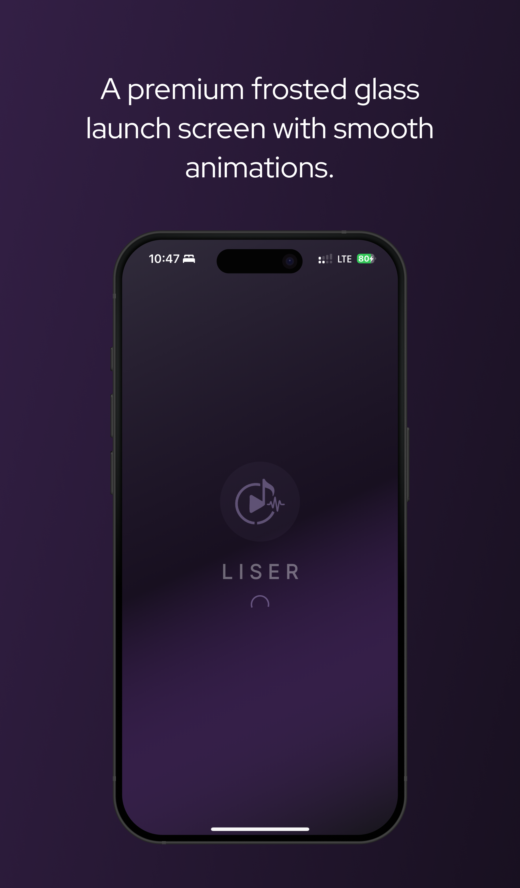
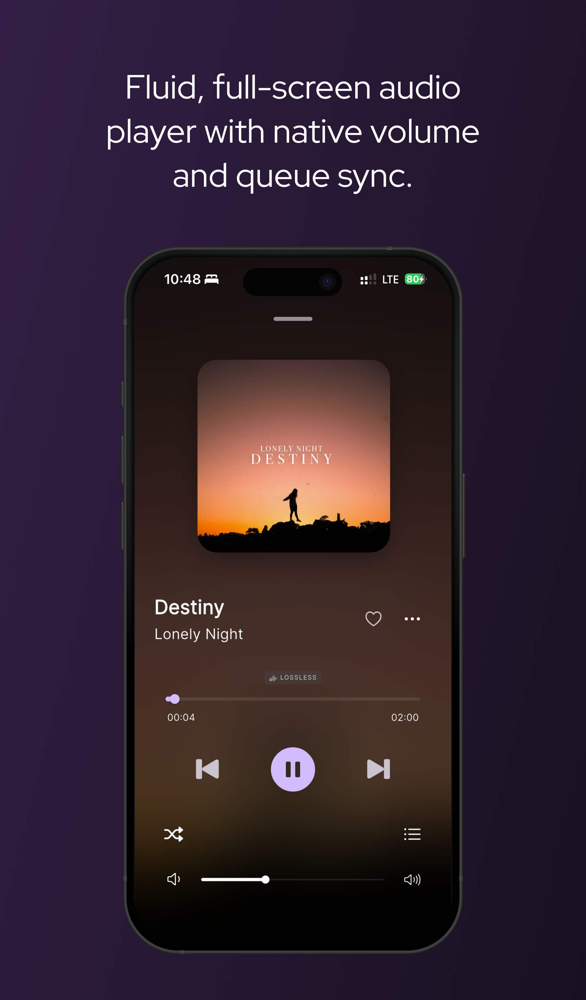

<div align="center">

<!-- TODO: Add your app logo/poster here -->


# Liser - An Opens Sourcs Local Music Player

**A beautiful, open-source, cross-platform music player for iOS and Android.**

[](https://flutter.dev)
[](https://dart.dev)
[](https://developer.android.com/)
[](https://developer.apple.com/)
[](https://pub.dev/packages/hive)
[](https://opensource.org/licenses/GPL-3.0)
[](http://makeapullrequest.com)


*Liser is designed to provide a premium, dynamic, and fluid listening experience. Built from the ground up with Flutter, it boasts native performance, flawless background playback, and gorgeous animations.*

[Features](#features) • [Screenshots](#screenshots) • [Installation](#installation) • [Contributing](#contributing) • [License](#license)

</div>

---

## ✨ Features

- 🎧 **Native Background Playback:** True lock-screen media controls on both iOS and Android.
- 🎨 **Dynamic UI:** Beautiful, morphing UI elements, custom animations, and a responsive queue layout.
- 🔊 **Native Hardware Volume Sync:** Seamlessly integrates with your device's physical volume buttons without clunky third-party packages.
- 🗃️ **Local Library Management:** Blazing fast metadata scanning and local file indexing using Hive.
- 🌙 **Dark/Light Modes:** Elegant themes that respect your system preferences.
- 📱 **Cross-Platform:** Runs beautifully on both iPhones and Android devices.

---

## 📸 Screenshots

<div align="center">
  
  &nbsp;&nbsp;&nbsp;&nbsp;
  
  &nbsp;&nbsp;&nbsp;&nbsp;
  
  &nbsp;&nbsp;&nbsp;&nbsp;
  
</div>

---

## 🚀 Installation & Build Instructions

### Prerequisites
- [Flutter SDK](https://flutter.dev/docs/get-started/install) (latest stable version)
- Xcode (for iOS build)
- Android Studio (for Android build)

### Steps to Run Locally

1. **Clone the repository**
   ```bash
   git clone https://github.com/abhijeet-Bh/liser.git
   cd liser
   ```

2. **Install dependencies**
   ```bash
   flutter pub get
   ```

3. **Generate Hive Adapters (If needed)**
   ```bash
   flutter packages pub run build_runner build --delete-conflicting-outputs
   ```

4. **Run the App**
   ```bash
   # For Android
   flutter run -d android

   # For iOS
   flutter run -d ios
   ```

> **Note for iOS Developers:** Liser uses custom `AVAudioSession` and `MPVolumeView` integrations in `AppDelegate.swift`. If you make changes to the native iOS code, a standard Hot Restart will not compile them. You must stop the debugger and perform a fresh `flutter run`.

---

## 🤝 Contributing

Liser is open-source and thrives on community contributions! Whether you're fixing a bug, designing a new feature, or improving documentation, your help is welcome.

Please read our [Contributing Guidelines](CONTRIBUTING.md) to get started!

1. Fork the Project
2. Create your Feature Branch (`git checkout -b feature/AmazingFeature`)
3. Commit your Changes (`git commit -m 'Add some AmazingFeature'`)
4. Push to the Branch (`git push origin feature/AmazingFeature`)
5. Open a Pull Request

---

## 📝 License

Distributed under the MIT License. See `LICENSE` for more information.

---
<div align="center">
  Made with ❤️ by <a href="https://github.com/abhijeet-Bh">Abhijeet</a> and contributors.
</div>
